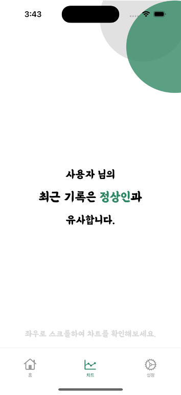

# 치매 분석 애플리케이션

---

> 사용자의 생활 데이터를 전달하여 치매 고위험군 웨어러블 데이터셋을 활용한 모델로부터 치매 환자와의 유사도를 분석하는 애플리케이션

### health Kit을 이용하여 아이폰 사용자의 건강 데이터를 불러 올 수 있으며, 사용자가 직접 데이터를 추가할 수 있음

---

### 1. 기기에서 사용자 데이터를 서버로 전달
### 2. 서버에서 학습 모델을 이용하여 결과 예측 및 기기로 전달
### 3. 기기에서 표시

---

### 구성

| 홈                                          | 차트                                          | 설정                                             |
|--------------------------------------------|---------------------------------------------|------------------------------------------------|
|  |  |  |

### 사용자 건강 데이터 요청

| 아이폰의 건강 데이터 접근                               | 
|----------------------------------------------|
|  |

### 사용자 건강 데이터 관리

| 건강 데이터 확인 및 관리                                   | 애플리케이션 내 데이터 확인 및 관리                              | 애플리케이션 내 데이터 추가                                   |
|--------------------------------------------------|---------------------------------------------------|---------------------------------------------------|
|  |  |  |

### 분석 및 시각화
| 사용자 데이터 분석 (정상인)                         | 사용자 데이터 분석 (치매 환자)                        | 차트                                              |
|------------------------------------------|-------------------------------------------|-------------------------------------------------|
|  |  |  |

### 설정
| 사용자 정보 표시                                      | 사용자 정보 설정                                     |
|------------------------------------------------|-----------------------------------------------|
|  |  |

### 프로필 및 권한 예외 처리

| 프로필 정보 업데이트 요청                                            | 권한 요청                                            |
|-----------------------------------------------------------|--------------------------------------------------|
|  |  |